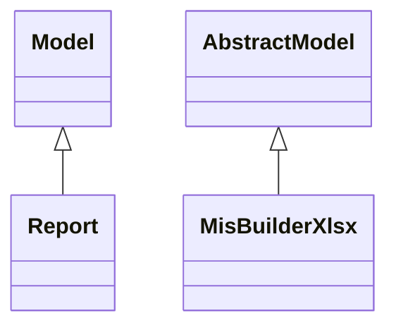

# Reports

Report definitions and templates in mis_builder.

## Available Reports

### PDF/Document Reports
- **MIS report instance QWEB PDF report** (PDF/Print)
- **MIS report instance XLS report** (PDF/Print)

## Report Files

- **__init__.py** (Python logic)
- **mis_report_instance_qweb.py** (Python logic)
- **mis_report_instance_qweb.xml** (XML template/definition)
- **mis_report_instance_xlsx.py** (Python logic)
- **mis_report_instance_xlsx.xml** (XML template/definition)

## Notes
- Named reports above are accessible through Odoo's reporting menu
- Python files define report logic and data processing
- XML files contain report templates, definitions, and formatting
- Reports are integrated with Odoo's printing and email systems
